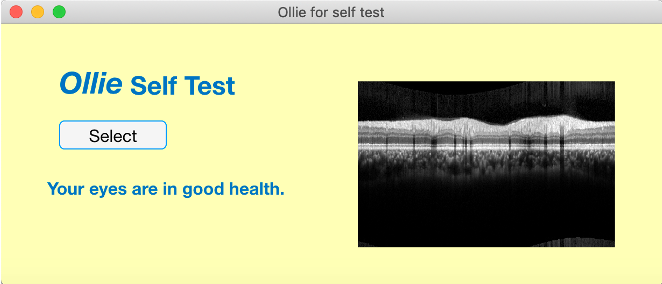
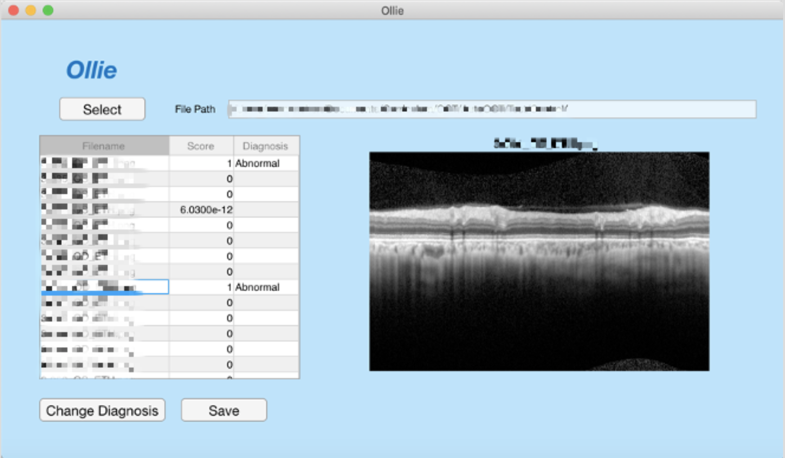

# Ollie (v0.0.1)

Ollie (v0.0.1) is a MATLAB-based app to identify glaucoma using deep learning. 

It was presented and won the first prize of healthcare panel at COLUMBIA HACKATHON 2019 organized by Columbia Business School and Engineering Graduate Student Council.

  

  

Contributors: Xinhui Li, Yannan Chen
